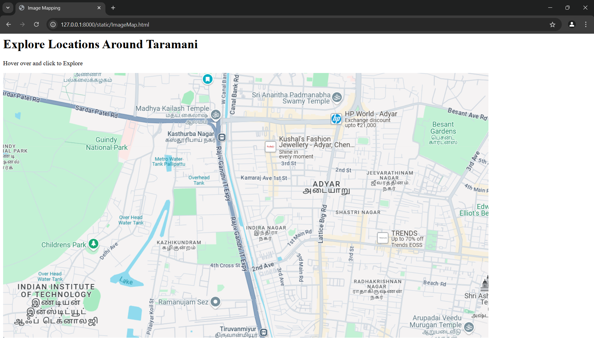
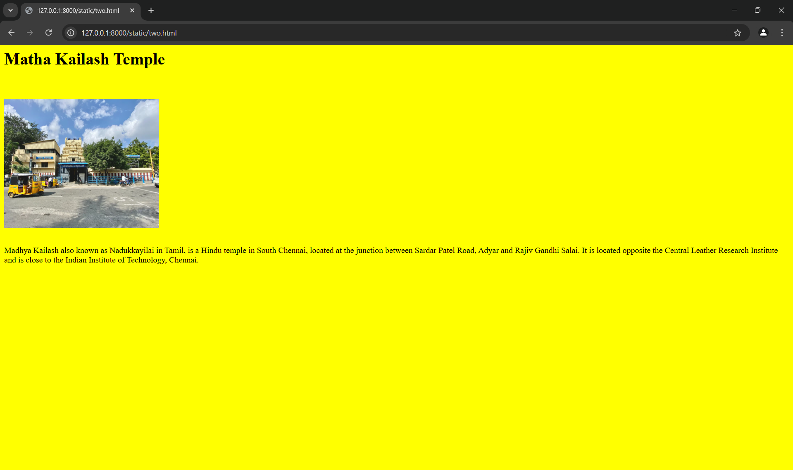
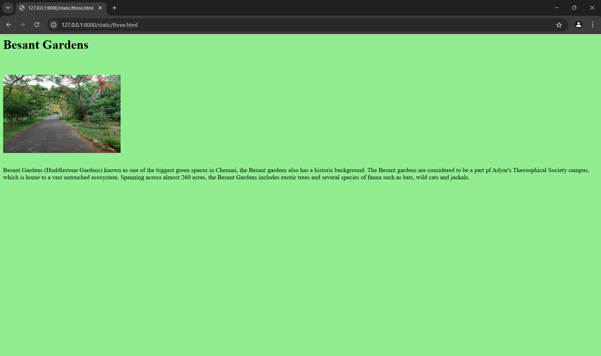
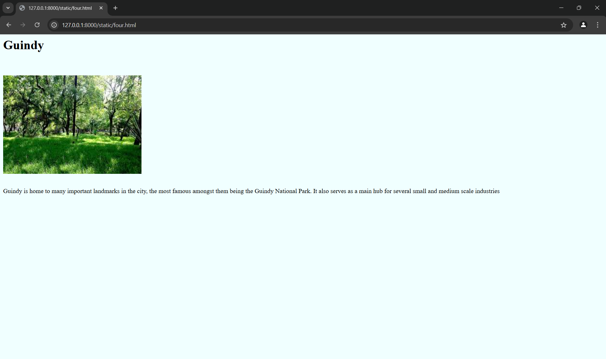
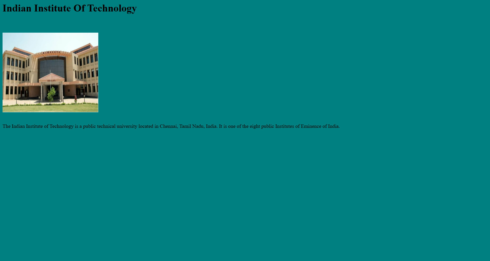

# Ex04 Places Around Me
## Date: 26-12-2024

## AIM
To develop a website to display details about the places around my house.

## DESIGN STEPS

### STEP 1
Create a Django admin interface.

### STEP 2
Download your city map from Google.

### STEP 3
Using ```<map>``` tag name the map.

### STEP 4
Create clickable regions in the image using ```<area>``` tag.

### STEP 5
Write HTML programs for all the regions identified.

### STEP 6
Execute the programs and publish them.

## CODE

```
<html>
    <head>
        <title>
            Image Mapping
        </title>
    </head>
    <body>
        <h1>Explore Locations Around Taramani</h1>
        <p>Hover over and click to Explore </p>

        <!-- Image Map Generated by http://www.image-map.net/ -->
        

        <map name="image-map">
            <area target="" alt="Children's Park" title="Children's Park" href="one.html" coords="93,422,249,466" shape="rect">
            <area target="" alt="Mathya Kailash Temple" title="Mathya Kailash Temple" href="two.html" coords="330,79,564,132" shape="rect">
            <area target="" alt="Besant Garden" title="Besant Garden" href="three.html" coords="1195,195,1081,120" shape="rect">
            <area target="" alt="Guindy" title="Guindy" href="four.html" coords="196,154,335,213" shape="rect">
            <area target="" alt="Indian Institute Of Technology" title="Indian Institute Of Technology" href="five.html" coords="17,538,255,659" shape="rect">
        </map>
    </body>
</html>
```

```
<html>
    <body bgcolor="lightblue">
        <h1>Children's Park</h1>
        <br>
        <br>
        
        <br>
        <br>
        <p>Situated in the heart of Chennai, the park occupies 22 acres of land and was inaugurated on 14 August 1959 by Pandit Jawaharlal Nehru, the then Prime Minister of India.</p>
    </body>
</html>
```

```
<html>
    <body bgcolor="yellow">
        <h1>Matha Kailash Temple</h1>
        <br>
        <br>
        
        <br>
        <br>
        <p>Madhya Kailash also known as Nadukkayilai in Tamil, is a Hindu temple in South Chennai, located at the junction between Sardar Patel Road, Adyar and Rajiv Gandhi Salai. It is located opposite the Central Leather Research Institute and is close to the Indian Institute of Technology, Chennai.</p>
    </body>
</html>
```

```
<html>
    <body bgcolor="lightgreen">
        <h1>Besant Gardens</h1>
        <br>
        <br>
        
        <br>
        <br>
        <p>Besant Gardens (Huddlestone Gardens) known as one of the biggest green spaces in Chennai, the Besant gardens also has a historic background. The Besant gardens are considered to be a part pf Adyar's Theosophical Society campus, which is home to a vast untouched ecosystem. Spanning across almost 260 acres, the Besant Gardens includes exotic trees and several species of fauna such as bats, wild cats and jackals. </p>
    </body>
</html>
```

```
<html>
    <body bgcolor="azure">
        <h1>Guindy</h1>
        <br>
        <br>
        
        <br>
        <br>
        <p>Guindy is home to many important landmarks in the city, the most famous amongst them being the Guindy National Park. It also serves as a main hub for several small and medium scale industries</p>
    </body>
</html>
```

```
<html>
    <body bgcolor="teal">
        <h1>Indian Institute Of Technology</h1>
        <br>
        <br>
        
        <br>
        <br>
        <p>The Indian Institute of Technology is a public technical university located in Chennai, Tamil Nadu, India. It is one of the eight public Institutes of Eminence of India. </p>
    </body>
</html>
```

## OUTPUT












## RESULT
The program for implementing image maps using HTML is executed successfully.
